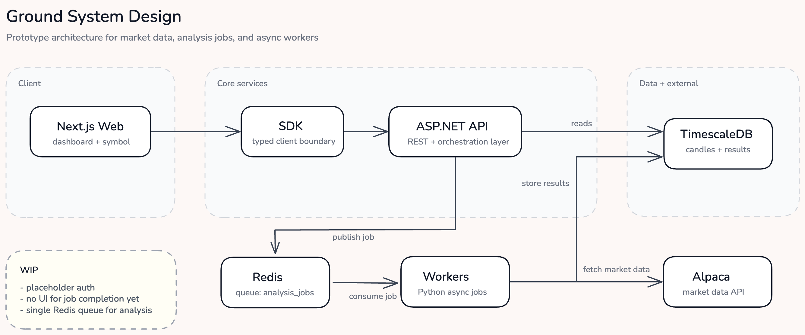

# Ground

Ground is a financial analysis platform prototype.

This repo is a monorepo with a Next.js frontend, an ASP.NET Core API, Python workers, Redis, and Postgres/TimescaleDB. The goal right now is not to be feature-complete. The goal is to have a clean local setup with the main system boundaries in place so the product can be built out without rewriting the foundation.

It is still a work in progress. A lot of the product surface exists in the UI, but much of the data behind it is placeholder-backed.

## Stack

- `apps/web`: Next.js App Router frontend
- `apps/api`: ASP.NET Core API
- `services/workers`: Python workers for async jobs and analysis
- `packages/sdk`: typed client used by the frontend
- `packages/shared-types`: shared contracts
- `Redis`: queueing
- `Postgres + TimescaleDB`: time-series and analysis storage
- `Alpaca`: market data / paper trading integration points

## Architecture



```text
Next.js UI
  -> SDK
  -> API
  -> Redis
  -> Workers
  -> TimescaleDB
  -> Alpaca
```

## Repo layout

```text
ground-platform/
  apps/
    web/
    api/
  services/
    workers/
  packages/
    sdk/
    shared-types/
  infra/
    docker/
    compose/
  scripts/
  docs/
```

## Current state

Implemented:

- app shell with dashboard, portfolio, analysis, alerts, settings, and symbol pages
- typed SDK between frontend and backend
- placeholder API surface for the main product areas
- Redis-backed analysis queue
- Python worker process
- TimescaleDB init and seed data
- Docker Compose local environment

Not done:

- real auth
- real portfolio data
- real alerting workflows
- real execution flows
- durable analysis history surfaced in the UI
- production deployment setup

## Local development

Requirements:

- Docker with `docker compose`
- Node.js `20+`
- npm `10+`

Set up env files:

```bash
cp .env.example .env
cp apps/web/.env.example apps/web/.env.local
```

If you want the worker to hit Alpaca when local candle data is missing, set `ALPACA_API_KEY` and `ALPACA_SECRET_KEY` in `.env`.

Start backend services:

```bash
cd infra/compose
docker compose --env-file ../../.env up --build
```

Or:

```bash
./scripts/dev-up.sh
```

Start the frontend in another terminal:

```bash
npm install
npm run dev:web
```

Open:

- frontend: `http://localhost:3000/dashboard`
- API: `http://localhost:8080/health`

## Main endpoints

- `GET /api/v1/dashboard`
- `GET /api/v1/symbols`
- `GET /api/v1/symbols/{symbol}/workspace`
- `GET /api/v1/candles/{symbol}`
- `GET /api/v1/portfolio`
- `GET /api/v1/analysis`
- `GET /api/v1/alerts`
- `GET /api/v1/settings`
- `POST /api/v1/analysis/run`

Example:

```bash
curl -X POST http://localhost:8080/api/v1/analysis/run \
  -H "Content-Type: application/json" \
  -d '{"symbol":"AAPL","analysisType":"basic"}'
```

That queues a job on `analysis_jobs`. The worker picks it up, runs placeholder analysis logic, and writes results back to Postgres.

## Data

Primary market table:

- `market_candles(symbol, ts, open, high, low, close, volume)`

Analysis output table:

- `analysis_results(symbol, analysis_type, computed_at, rsi, sma_20, sma_50)`

`market_candles` is initialized as a Timescale hypertable.

## Notes

- The frontend uses the SDK package instead of calling the API directly from every page.
- The API currently includes placeholder JWT middleware only.
- The UI is broader than the real backend implementation on purpose. The product surface is being laid out first, then the placeholder data gets replaced incrementally.
