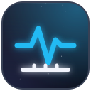

# Ground

A prototype financial-analysis platform: a Next.js workspace over an ASP.NET Core API that queues analysis jobs to Python workers through Redis and stores market data in TimescaleDB.

[](#status)


[](https://pulse-web-psi.vercel.app)

## What it does

- Serves a workspace UI (dashboard, symbol, portfolio, analysis, alerts, settings) from a Next.js App Router app that talks to the API only through a typed SDK package.
- Exposes a versioned minimal API (`/api/v1/...`) for symbols, candles, dashboard, portfolio, analysis, alerts and settings, plus `/health`.
- Reads OHLCV candles from a TimescaleDB hypertable (`market_candles`, primary key `(symbol, ts)`).
- Accepts `POST /api/v1/analysis/run`, validates the symbol, pushes a job onto a Redis list and returns `202 Accepted`.
- Runs a Python worker that consumes jobs, backfills missing candles from Alpaca market data when configured, computes RSI and 20/50-period SMAs with pandas, and writes the result to `analysis_results`.

## How it works

```mermaid
flowchart LR
    W[Next.js web<br/>apps/web] -->|@ground/sdk| A[ASP.NET Core API<br/>apps/api]
    A -->|SELECT candles| DB[(Postgres + TimescaleDB<br/>market_candles hypertable<br/>analysis_results)]
    A -->|LPUSH analysis_jobs| Q[(Redis)]
    Q -->|BRPOP| K[Python worker<br/>services/workers]
    K -->|read candles| DB
    K -->|missing data| AL[Alpaca market data API]
    K -->|upsert candles<br/>insert results| DB
```

Mechanisms that exist in the code today:

- **Background worker over a queue.** The API publishes JSON jobs to the `analysis_jobs` Redis list (`RedisQueuePublisher`); the worker blocks on `BRPOP` with a 5 s timeout, and a failed job is logged and followed by a 2 s pause instead of killing the loop (`services/workers/main.py`).
- **Graceful degradation.** If `ANALYSIS_QUEUE_ENABLED` is false or Redis is not configured, the API swaps in a no-op publisher and keeps serving (the Render blueprint uses this mode).
- **Idempotent writes and schema setup.** Candle backfills use `INSERT ... ON CONFLICT (symbol, ts) DO UPDATE`, so re-fetching the same bars is safe. On startup the API runs `CREATE ... IF NOT EXISTS`, `create_hypertable(..., if_not_exists => TRUE)` and a seed with `ON CONFLICT DO NOTHING`, so repeated boots converge on the same schema.
- **Bounded external calls.** Alpaca requests use a 20 s timeout.
- **Operational basics.** JSON console logging, a single-origin CORS policy, `postgres://` URL normalization for hosted databases, and Docker health checks gating API and worker startup.

Contracts shared between the web app and SDK live in `packages/shared-types`. The data model is two tables: `market_candles(symbol, ts, open, high, low, close, volume)` and `analysis_results(symbol, analysis_type, computed_at, rsi, sma_20, sma_50)`.

## Getting started

Requires Docker with `docker compose`, Node.js 20+ and npm 10+.

```bash
cp .env.example .env
cp apps/web/.env.example apps/web/.env.local
npm run compose:up          # Postgres/TimescaleDB, Redis, API, worker
```

In a second terminal:

```bash
npm install
npm run dev:web             # http://localhost:3000/dashboard
```

The API listens on `http://localhost:8080` (`/health`, Swagger in Development). Queue an analysis job:

```bash
curl -X POST http://localhost:8080/api/v1/analysis/run \
  -H "Content-Type: application/json" \
  -d '{"symbol":"AAPL","analysisType":"basic"}'
```

Set `ALPACA_API_KEY` and `ALPACA_SECRET_KEY` in `.env` to let the worker fetch candles that are not in the database. Other scripts: `npm run build:web`, `npm run lint:web`, `npm run compose:down`.

Deployment notes: [docs/vercel-deployment.md](docs/vercel-deployment.md) for the frontend, [docs/render-free-cli-setup.md](docs/render-free-cli-setup.md) and `render.yaml` for the API.

## Status

Work in progress. The system boundaries are real: web to SDK to API, API to Redis to worker, worker to TimescaleDB and Alpaca. Much of the product surface is not yet backed by real data.

- Real: candle reads, the analysis queue, the worker and its indicator math, schema setup.
- Placeholder: dashboard, symbol workspace, portfolio, analysis workspace, alerts and settings responses (`PlaceholderPlatformService`), and auth (`PlaceholderJwtMiddleware` only tags requests; it does not validate tokens).
- Not yet: reliable-queue semantics (a job popped by a worker that crashes mid-run is lost), retries on worker failures, analysis history in the UI, execution flows.

The live demo serves the frontend shell with prototype data.

## How this project is run

[](https://linear.app)
[](AGENTS.md)
[](#how-this-project-is-run)

- **Planning:** work is tracked in Linear as initiatives → projects → milestones → issues; branches and PR titles carry the issue ID so status moves automatically from In Progress to Done.
- **Review:** every pull request gets an automatic Codex review guided by this repo's own Code Review Rules in [`AGENTS.md`](AGENTS.md), and review threads must be resolved before merge.
- **Guardrails:** the default branch (`main`) only changes through pull requests — no direct pushes or force-pushes.

## License

MIT. See [LICENSE](LICENSE).

---
<sub>Built by [Aladdin Ali](https://github.com/NaxeCode) · [naxecode.github.io](https://naxecode.github.io)</sub>
